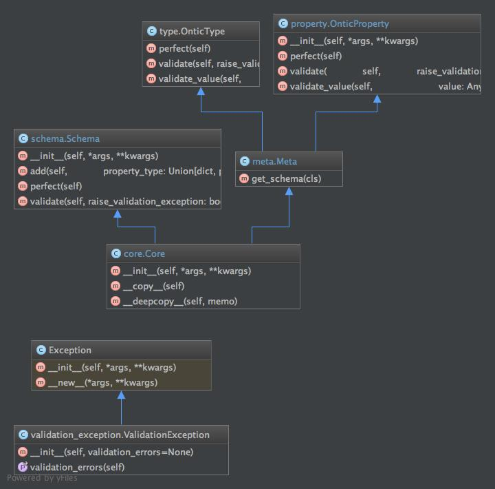

.. _getting-started-with-ontic:

===========================
Getting Started with Ontic
===========================

**Ontic** objects strive to provide all the benefits of utilizing a Python dict
object, with the benefits of having class-like attributes for data access.
The default behavior of an **Ontic** object to to be a schema-less dictionary.
The example for the simplest **Ontic** object is::

  >>> from ontic.ontic_type import OnticType
  >>> my_object = OnticType()
  >>> my_object['some_property'] = 'Some value'
  >>> my_object.other_property = 3
  >>> my_object

Creation of Ontic Types
========================

Schema Definitions
-------------------

Ontic Class Definitions
------------------------

Dynamic Type Definitions
-------------------------

Working with Ontic Objects
===========================
